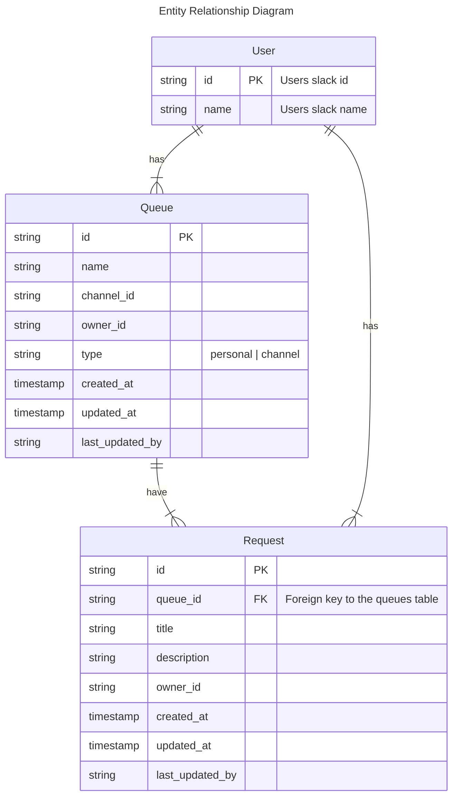

# Readme

```mermaid
---
title: Entity Relationship Diagram
---
erDiagram

User {
    string id PK "Users slack id"
    string name "Users slack name"
}

Queue {
    string id PK
    string name
    string channel_id
    string owner_id
    string type "personal | channel"
    timestamp created_at
    timestamp updated_at
    string last_updated_by
}

Request {
    string id PK
    string queue_id FK "Foreign key to the queues table"
    string title
    string description
    string owner_id
    timestamp created_at
    timestamp updated_at
    string last_updated_by
}

Queue ||--|{ Request : have
User ||--|{ Queue : has
User ||--|{ Request : has


```
