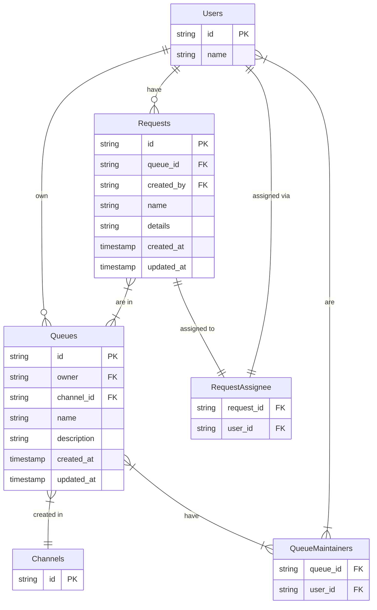

# Database

## ERD

```mermaid
erDiagram

Channels {
    string id PK
}

Users {
    string id PK
    string name
}

Queues {
    string id PK
    string owner FK
    string channel_id FK
    string name
    string description
    timestamp created_at
    timestamp updated_at
}

Requests {
    string id PK
    string queue_id FK
    string created_by FK
    string name
    string details
    timestamp created_at
    timestamp updated_at
}

QueueMaintainers {
    string queue_id FK
    string user_id FK
}

RequestAssignee {
    string request_id FK
    string user_id FK
}

Users ||--o{ Queues : own
Users ||--o{ Requests : have
Requests }|--|{ Queues : "are in"
Queues }|--|| Channels : "created in"
Queues }|--|{ QueueMaintainers: "have"
Users }|--|{ QueueMaintainers : "are"
Requests ||--|| RequestAssignee : "assigned to"
Users ||--|| RequestAssignee : "assigned via"

```
